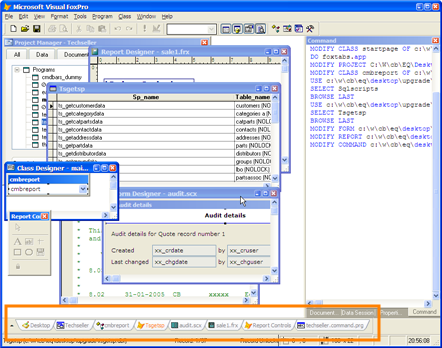
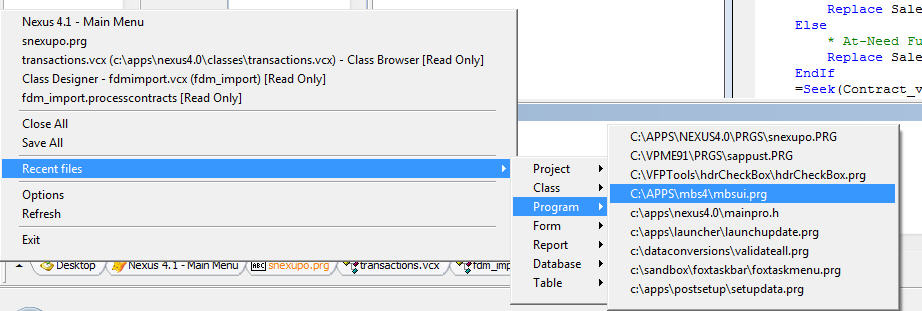
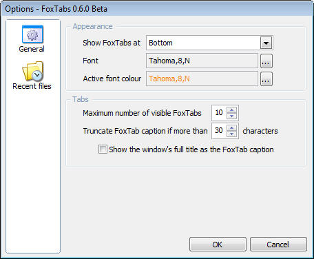

# FoxTabs
**Create tabs along the bottom of the VFP IDE for each file open in Visual FoxPro.**

Project Manager: [Joel Leach](https://github.com/JoelLeach)

FoxTabs is a handy little utility for adding a tabbed window interface to the VFP IDE.  It is written in VFP and uses BindEvents heavily. With the limited space available in the VFP IDE, it can be time consuming to find and switch among open windows. FoxTabs makes it easier to find the correct editor or designer you have open.

FoxTabs is a project originally started in Australia by Scott Scovell and Craig Bailey. Their generosity made the move to VFPX simple and allows the development to progress. Thanks to both!

## Installation
To use, simply download FoxTabs.app and **DO FOXTABS.APP** in the VFP IDE.

To add to your VFP Tools menu, **DO FOXTABS.APP WITH "-M"**.

## Overview
Here's an overview of FoxTabs in the IDE:

Here's a closer look at the FoxTabs bar:

Here's what is available from the menu: 

And here's the options dialog:

If you would like to know how FoxTabs works, take a look at [Doug Hennig's excellent article](content/FoxTabs_FoxTabsArticle.pdf) on the subject.

Here is the [PowerPoint file](content/FoxTabs_FoxTabs_IDE_Tool.ppt) from a presentation Scott Scovell did on FoxTabs at OzFox.